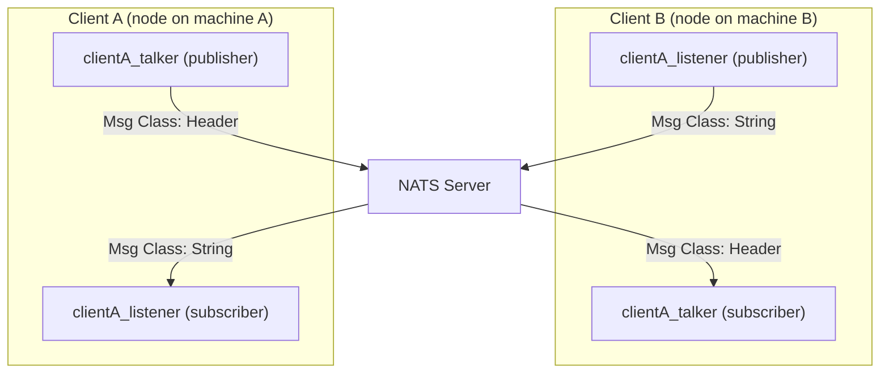

# NATS Connector for ROS

Enables pub/sub messaging between two robots in different networks over [NATS](https://nats.io/). The NATS Connector acts as a message forwarder between the local ROS network and the NATS network. Data flows from a publisher in ROS to a publisher in NATS which sends the messages to any subscriber connected to the NATS server, anywhere in the world. On the other end, a NATS subscriber forwards the data to a ROS subscriber which then uses that data from the original publisher.

## Usage

To use this package, add a single instance of the following node somewhere in your main launch-file and make sure to update the parameters according to your needs. Check out the [Examples](#Examples) to see this in action.

```xml
<node name="nats_connector" pkg="nats_ros_connector" type="nats_connector.py" output="screen">
    <param name="host" value="nats://host.docker.internal:4222" />
    <rosparam>
        publishers:
            - topicA
            - /topicB
            - /topicC/A
            - /topicD/A/B
        subscribers:
            - topicE
            - /topicF
            - /topicG/A
            - /topicH/A/B
        services:
            - serviceA
            - /serviceB
            - /ServiceC/A
            - /ServiceD/A/B
        service_proxies:
            - name: serviceE
              type: [serviceE type] # eg. std_srvs/Trigger
            - name: /serviceF
              type: [serviceF type] # eg. std_srvs/Bool
            - name: /serviceG/A
              type: [serviceG/A type]
            - name: /serviceH/A/B
              type: [serviceH/A/B type]
    </rosparam>
</node>
```

-   In `host` you provide the address to your NATS server (in the example above, the NATS server is running locally, while ROS is running in a Docker container both on the same machine, so `host.docker.internal` is used to get the address of the localhost relative to the container.

Inside of the `<rosparam>` tags you provide the lists of `publishers`, `subscribers`, `services`, and `service_proxies` in the YAML format.

-   In `publishers`, you provided a list of all the topics which you would like to publish from ROS to NATS.

-   In `subscribers`, you provided a list of all the topics which you would like to subscribe to from NATS to ROS.

-   In `services`, you provide a list of all services are advertised in your ROS nodes and should in turn be advertised to other NATS clients

-   In `service_proxies`, you provide a sequence of mappings each mapping containing the `name` and `type` of the service. This will make sure that NATS reaches out to a client advertising the service when you create a service proxy in your ROS nodes. Note that `wait_for_message` does not guarantee that the client advertising the services over NATS is guaranteed to exists. Therefore, you might encounter the error: _`NATS Service Proxy ERROR: REQUEST FOR [service_name] has no NATS responders available (No NATS Client is advertising this service yet)`_, which means that that a request was sent, but NATS found no launched client advertising the service. So far, we leave it up to the user to ensure that a service is up.

    The topic names may begin with or without a forward-slash `/`. Furthermore, the namespaces in ROS, created with `/` are translated to the NATS token separator `.`. For instance the topic name `/topicH/A/B`, in ROS, becomes `topicH.A.B` in NATS. This happens under the hood and you don't need to worry about it. To learn more about the naming system in ROS, read this [article](http://wiki.ros.org/Names). To learn more about the naming system in NATS, read this [article](https://docs.nats.io/nats-concepts/subjects) to under

<details>
<summary>Other supported parameters include</summary>

`name=None, pedantic=False, verbose=False, allow_reconnect=True, connect_timeout=2, reconnect_time_wait=2, max_reconnect_attempts=60, ping_interval=120, max_outstanding_pings=2, dont_randomize=False, flusher_queue_size=1024, no_echo=False, tls=None, tls_hostname=None, user=None, password=None, token=None, drain_timeout=30, signature_cb=None, user_jwt_cb=None, user_credentials=None, nkeys_seed=None`

These are used when creating the NATS Client connection. See the [nats.py documentation](https://nats-io.github.io/nats.py/modules.html#asyncio-client).

</details>

## Installation

1. Clone this repository into the `src` folder in your ROS workspace.

    ```
    git clone https://github.com/aljanabim/nats-ros-connector
    ```

2. Install `nats-py`

    ```
    pip3 install nats-py==2.2.0
    ```

### Install Python Dependencies

Ensure pip is installed

```
sudo apt update
sudo apt install python3-pip
pip3 --version
```

then, install `nats-py`

```
pip3 install nats-py==2.2.0
```

## Examples

The NATS ROS Connector includes an example which demonstrates bi-directional messaging between two clients `ClientA` and `ClientB`. Each client is meant run on separate machine with distinct ROS Cores. With a NATS Server that's accessible to both clients, it's possible to bridge the networking gap between the clients and enable bi-directional communication. The example can scale to as many number of clients and topics as the network bandwidth and the NATS Server can handle. The messaging and services layout in the example is follows:

-   `ClientA` publishes a topic called `clientA_talker` of msg type `std_msgs/Header` and subscribers to a topic called `clientA_listener` of msg type `std_msgs/String`.
-   `ClientB` publishes a topic called `clientA_listener` of msg type `std_msgs/String` and subscribers to a topic called `clientA_talker` of msg type `std_msgs/Header`.
-   `ClientA` advertises a service called `trigger_clientA` of service type `std_srvs/Trigger` and creates a service proxy to `trigger_clientB` of service type `std_srvs/SetBool`.
-   `ClientB` advertises a service called `trigger_clientB` of service type `std_msgs/SetBool` and creates a service proxy to `trigger_clientA` of service type `std_srvs/Trigger`.



### Running the examples

1. Start by running a NATS Server and make sure it is accessible to both clients.

2. Modify the url to your NATS Server inside the launch file corresponding to each client. For ClientA, edit the `host` param in [example_clientA.launch](./launch/example_clientA.launch) and for ClientB, edit the `host` param in [example_clientB.launch](./launch/example_clientB.launch)

3. On Machine A start ClientA by running

    ```
    roslaunch nats_ros_connector example_clientA.launch
    ```

4. On Machine B start ClientB by running
   `   roslaunch nats_ros_connector example_clientB.launch`

Both clients sleep for `2` seconds before they start calling the service proxies, giving you time to launch both ends.

### Example output

On `ClientA` you should see output similar to the following, with new messages arriving at `1Hz`

```
SERVICE RESULT OF trigger_clientB
 success: False
message: "Client B just got Bowling!"

SERVICE RESULT OF trigger_clientB
 success: False
message: "Client B just got Bowling!"

SERVICE RESULT OF trigger_clientB
 success: False
message: "Client B just got Bowling!"

SERVICE RESULT OF trigger_clientB
 success: False
message: "Client B just got Bowling!"

SERVICE RESULT OF trigger_clientB
 success: False
message: "Client B just got Bowling!"

SERVICE RESULT OF trigger_clientB
 success: False
message: "Client B just got Bowling!"

from clientA_listener
 data: "1683315536801697492"

SERVICE RESULT OF trigger_clientB
 success: False
message: "Client B just got Bowling!"

SERVICE RESULT OF trigger_clientB
 success: False
message: "Client B just got Bowling!"

from clientA_listener
 data: "1683315538801133871"

SERVICE RESULT OF trigger_clientB
 success: False
message: "Client B just got Bowling!"

SERVICE RESULT OF trigger_clientB
 success: False
message: "Client B just got Bowling!"

from clientA_listener
 data: "1683315540808658599"
```

On `ClientB` you should see output similar to the following, with new messages arriving at `.5Hz`

```
from clientA_talker
 seq: 0
stamp:
  secs: 1683315593
  nsecs: 274091482
frame_id: ''

SERVICE RESULT OF trigger_clientA
 success: True
message: "Hello Trigger from Client A"

SERVICE RESULT OF trigger_clientA
 success: True
message: "Hello Trigger from Client A"

from clientA_talker
 seq: 0
stamp:
  secs: 1683315594
  nsecs: 242599487
frame_id: ''

from clientA_talker
 seq: 0
stamp:
  secs: 1683315595
  nsecs: 246570825
frame_id: ''

SERVICE RESULT OF trigger_clientA
 success: True
message: "Hello Trigger from Client A"

from clientA_talker
 seq: 0
stamp:
  secs: 1683315596
  nsecs: 248357772
frame_id: ''
```

The script for `ClientA` is in [scripts/example_clientA.py](./scripts/example_clientA.py) and the script for `ClientB` is in [scripts/example_clientB.py](./scripts/example_clientB.py)

## Road Map

-   [x] Support Publishers
-   [x] Support Subscribers
-   [x] Allow topic names that begin with forward-slash, ie. "/topic_name"
-   [x] Support ROS Namespaces (via translation into NATS Subject token)
-   [x] Support Authenticated NATS Servers
-   [x] Support Services
-   [ ] Robustly Services and enable `wait_for_service` to work over NATS too.
